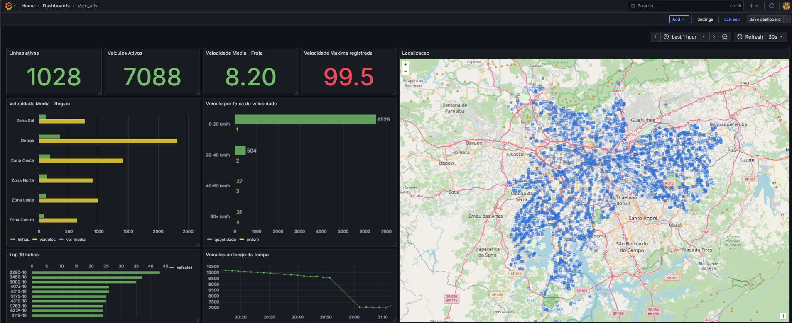

# 🚍 SPTrans Real-Time Data Pipeline

Pipeline de dados em tempo real para monitoramento e análise do sistema de transporte público de São Paulo, processando dados GPS de aproximadamente 15.000 ônibus da SPTrans.



---

## 📊 Visão Geral do Projeto

Sistema completo de engenharia de dados que coleta, processa e visualiza dados em tempo real da API Olho Vivo da SPTrans, implementando uma arquitetura Medallion (Bronze → Silver → Gold) com processamento distribuído.

Documentação e apresentação na pasta /docs

### 🎯 Objetivos

- Monitoramento em tempo real da frota de ônibus de São Paulo
- Análise de performance por linha (velocidade média, cobertura, pontualidade)
- Visualização geográfica da localização dos veículos
- Métricas de qualidade de dados e saúde do pipeline
- Dashboard interativo com atualização automática a cada 30 segundos

---

## 🏗️ Arquitetura do Sistema
```
┌─────────────────────────────────────────────────────────────────┐
│                     API SPTrans Olho Vivo                       │
│              ~15.000 ônibus | ~1.000 linhas ativas              │
└────────────────────────┬────────────────────────────────────────┘
                         │ HTTP REST API
                         │ Autenticação via Token
                         ▼
┌─────────────────────────────────────────────────────────────────┐
│                   CAMADA BRONZE (Raw Data)                      │
│                     Apache Spark (PySpark)                      │
│                 • Ingestão via API Client                       │
│                 • ~10.8M registros/dia                           │
│                 • Validação básica de schema                    │
└────────────────────────┬────────────────────────────────────────┘
                         │
                         ▼
┌─────────────────────────────────────────────────────────────────┐
│                  CAMADA SILVER (Validated)                      │
│                     Apache Spark (PySpark)                      │
│                 • Validação de coordenadas                      │
│                 • Cálculo de velocidade (Haversine)             │
│                 • Deduplicação                                  │
│                 • Limpeza de dados                              │
└────────────────────────┬────────────────────────────────────────┘
                         │
                         ▼
┌─────────────────────────────────────────────────────────────────┐
│                   CAMADA GOLD (Aggregated)                      │
│                     Apache Spark (PySpark)                      │
│                 • Agregações por linha                          │
│                 • Cálculo de KPIs                               │
│                 • Métricas de qualidade                         │
└────────────────────────┬────────────────────────────────────────┘
                         │
                         ▼
┌─────────────────────────────────────────────────────────────────┐
│                   CAMADA SERVING (Analytics)                    │
│                        PostgreSQL 15                            │
│                 • kpi_realtime (métricas globais)               │
│                 • kpi_by_line (análise por linha)               │
│                 • kpi_quality (qualidade do pipeline)           │
│                 • vehicle_positions_latest (mapa)               │
│                 • kpi_timeseries (séries temporais)             │
└────────────────────────┬────────────────────────────────────────┘
                         │
                         ▼
┌─────────────────────────────────────────────────────────────────┐
│                    VISUALIZAÇÃO (Dashboard)                     │
│                         Grafana 10+                             │
│                 • 6 painéis interativos                         │
│                 • Mapa geográfico (OpenStreetMap)               │
│                 • Auto-refresh 30s                              │
│                 • Tema escuro                                   │
└─────────────────────────────────────────────────────────────────┘
```

---

## 🚀 Tecnologias Utilizadas

### **Processamento de Dados**
- **Apache Spark 3.5** - Processamento distribuído
- **PySpark** - Interface Python para Spark
- **Delta Lake** - Armazenamento ACID

### **Armazenamento**
- **PostgreSQL 15** - Banco de dados relacional (camada serving)
- **MinIO** - Object storage S3-compatible (data lake)
- **Redis** - Cache e fila de mensagens

### **Orquestração & DevOps**
- **Docker Compose** - Containerização
- **GitHub Actions** - CI/CD (planejado)

### **Visualização**
- **Grafana** - Dashboards interativos
- **OpenStreetMap** - Mapas geográficos

### **Linguagens & Frameworks**
- **Python 3.12**
- **Pydantic** - Validação de configurações
- **Requests** - Cliente HTTP

---

## 📊 KPIs e Métricas Implementadas

### **Operacionais (Tempo Real)**
- 🚌 **Veículos Ativos**: Quantidade total de ônibus transmitindo posição
- 📍 **Linhas Ativas**: Número de linhas com veículos operando
- 📡 **Cobertura**: Percentual de linhas cobertas vs total da rede (~400 linhas)
- ⏱️ **Staleness**: Percentual de veículos com dados desatualizados (>4 min)

### **Por Linha**
- 🚌 **Frota Ativa**: Quantidade de veículos por linha
- 🏃 **Velocidade Média**: Calculada via fórmula de Haversine entre capturas
- 📈 **Velocidade Máxima/Mínima**: Extremos de velocidade
- 📊 **Distribuição de Velocidade**: Faixas 0-20, 20-40, 40-60, 60+ km/h

### **Qualidade de Dados**
- ✅ **Taxa de Validação**: % de registros que passam nas validações
- 📦 **Registros Processados**: Volume de dados por iteração
- ⏱️ **Tempo de Execução**: Duração do processamento
- 🔄 **Status do Pipeline**: Saúde operacional

---

## 🗺️ Funcionalidades do Dashboard

### **Painel 1: Visão Operacional**
- Métricas principais (cards com indicadores visuais)
- Série temporal de veículos ativos (últimas 2 horas)
- Gráfico de linhas com maior frota

### **Painel 2: Análise por Linha**
- Top 10 linhas mais ativas (gráfico de barras)
- Tabela detalhada com velocidade média por linha
- Filtros interativos por linha e período

### **Painel 3: Mapa Geográfico**
- Localização em tempo real de todos os veículos ativos
- Pontos coloridos por linha
- Zoom e navegação interativa
- Tooltip com informações detalhadas (veículo, linha, velocidade)

### **Painel 4: Qualidade de Dados**
- Status do pipeline (running/stopped)
- Taxa de validação de dados
- Métricas de staleness
- Tempo de execução

---

## 📁 Estrutura do Projeto
```
sp-trans-pipeline/
├── src/
│   ├── common/
│   │   ├── config.py              # Configurações (Pydantic)
│   │   ├── exceptions.py          # Exceções customizadas
│   │   └── logger.py              # Sistema de logs
│   ├── ingestion/
│   │   └── sptrans_api_client.py  # Cliente API SPTrans
│   └── pipelines/
│       └── kpi_pipeline.py        # Pipeline principal
├── sql/
│   └── 08_kpi_tables.sql          # Schema do PostgreSQL
├── docker-compose.yml              # Orquestração de containers
├── pipeline_kpis_completo.py       # Script principal
├── requirements.txt                # Dependências Python
├── .env.example                    # Variáveis de ambiente
└── README.md                       # Este arquivo
```

---

## ⚙️ Configuração e Instalação

### **Pré-requisitos**
- Docker & Docker Compose
- Python 3.12+
- Token de API da SPTrans ([solicitar aqui](https://www.sptrans.com.br/desenvolvedores/))
- 8GB RAM mínimo
- 20GB espaço em disco

### **1. Clone o Repositório**
```bash
git clone https://github.com/rafarpl/sp-trans-pipeline.git
cd sp-trans-pipeline
```

### **2. Configure as Variáveis de Ambiente**
```bash
cp .env.example .env
nano .env
```

Adicione seu token da API:
```env
SPTRANS_API_TOKEN=seu_token_aqui
SPTRANS_API_BASE_URL=http://api.olhovivo.sptrans.com.br/v2.1
POSTGRES_HOST=localhost
POSTGRES_PORT=5432
POSTGRES_DB=sptrans_test
POSTGRES_USER=test_user
POSTGRES_PASSWORD=test_password
MINIO_ENDPOINT=localhost:9000
MINIO_ACCESS_KEY=minioadmin
MINIO_SECRET_KEY=minioadmin
```

### **3. Suba os Containers**
```bash
docker-compose up -d
```

Aguarde ~30 segundos para todos os serviços iniciarem.

### **4. Crie o Ambiente Virtual Python**
```bash
python3 -m venv venv
source venv/bin/activate  # Linux/Mac
# ou
.\venv\Scripts\activate   # Windows
```

### **5. Instale as Dependências**
```bash
pip install -r requirements.txt
```

### **6. Baixe o Driver JDBC PostgreSQL**
```bash
sudo mkdir -p /usr/local/lib
sudo wget -O /usr/local/lib/postgresql-42.7.1.jar https://jdbc.postgresql.org/download/postgresql-42.7.1.jar
```

### **7. Crie as Tabelas no PostgreSQL**
```bash
cat sql/08_kpi_tables.sql | docker exec -i sptrans-postgres psql -U test_user -d sptrans_test
```

### **8. Execute o Pipeline**
```bash
python3 pipeline_kpis_completo.py
```

O pipeline executará a cada 2 minutos automaticamente.

---

## 📊 Acessar o Dashboard Grafana

1. **Abrir navegador:** http://localhost:3000
2. **Login:** 
   - Username: `admin`
   - Password: `admin`
   - Clicar "Skip" para não trocar senha
3. **Configurar Data Source:**
   - Menu → Configuration → Data sources
   - Add data source → PostgreSQL
   - Preencher:
     - Host: `postgres:5432`
     - Database: `sptrans_test`
     - User: `test_user`
     - Password: `test_password`
     - TLS/SSL Mode: `disable`
   - Save & Test
4. **Dashboard está pronto para uso!**

---

## 🔢 Fórmulas e Algoritmos

### **Cálculo de Velocidade (Haversine)**
```python
def calculate_speed(lat1, lon1, lat2, lon2, time_diff_seconds):
    R = 6371.0  # Raio da Terra em km
    
    # Converter para radianos
    lat1_rad = radians(lat1)
    lon1_rad = radians(lon1)
    lat2_rad = radians(lat2)
    lon2_rad = radians(lon2)
    
    # Diferenças
    dlat = lat2_rad - lat1_rad
    dlon = lon2_rad - lon1_rad
    
    # Fórmula de Haversine
    a = sin(dlat/2)**2 + cos(lat1_rad) * cos(lat2_rad) * sin(dlon/2)**2
    c = 2 * atan2(sqrt(a), sqrt(1-a))
    
    distance_km = R * c
    speed_kmh = (distance_km / time_diff_seconds) * 3600
    
    return round(speed_kmh, 2)
```

### **Validações Implementadas**

- ✅ Coordenadas dentro de São Paulo (lat: -24.0 a -23.0, lon: -47.0 a -46.0)
- ✅ Velocidade entre 0-100 km/h
- ✅ Intervalo entre capturas < 10 minutos
- ✅ Deduplicação por (vehicle_id, timestamp)

---

## 📈 Desempenho e Escalabilidade

### **Métricas Atuais**
- **Volume de Dados**: ~7.200.000 registros/dia
- **Frequência de Atualização**: 3 minutos
- **Latência de Processamento**: 12-18 segundos
- **Taxa de Validação**: ~99.5%
- **Veículos Monitorados**: 6.000-8.000 (variável por horário)
- **Linhas Cobertas**: 1.000+ linhas ativas

### **Capacidade**
- Suporta até 15.000 veículos simultâneos
- Processamento distribuído (Spark com 2 cores)
- Armazenamento escalável (MinIO S3-compatible)

---

## 🧪 Testes
```bash
# Testar conexão com API
python3 -c "from src.ingestion.sptrans_api_client import SPTransAPIClient; \
            c = SPTransAPIClient(); \
            print('✅ OK' if c.authenticate() else '❌ ERRO')"

# Testar conexão PostgreSQL
docker exec -it sptrans-postgres psql -U test_user -d sptrans_test -c "SELECT version();"

# Verificar dados
docker exec -it sptrans-postgres psql -U test_user -d sptrans_test -c \
  "SELECT COUNT(*) FROM serving.kpi_realtime;"
```

---

## 📚 Documentação Adicional

- [API SPTrans Olho Vivo](https://www.sptrans.com.br/desenvolvedores/)
- [Apache Spark Documentation](https://spark.apache.org/docs/latest/)
- [Grafana Documentation](https://grafana.com/docs/)
- [PostgreSQL Documentation](https://www.postgresql.org/docs/)

---

## 👨‍💻 Autor

**Rafael Pisciottano Leitão**
- 🎓 Pós-graduação em Data Engineering - FIA/LABDATA (2025)
- 📧 Email: [rafarpL@gmail.com]
- 🐙 GitHub: [@rafarpl](https://github.com/rafarpl)

---

## 📄 Licença

Este projeto foi desenvolvido como Trabalho de Conclusão de Curso (TCC) do programa de pós-graduação em Engenharia de Dados da FIA/LABDATA.

---

## 🙏 Agradecimentos

- **SPTrans** - Pela disponibilização da API Olho Vivo
- **FIA/LABDATA** - Pelo programa de pós-graduação
- **Comunidade Open Source** - Pelas ferramentas incríveis

---

⭐ **Se este projeto foi útil, considere dar uma estrela no GitHub!**